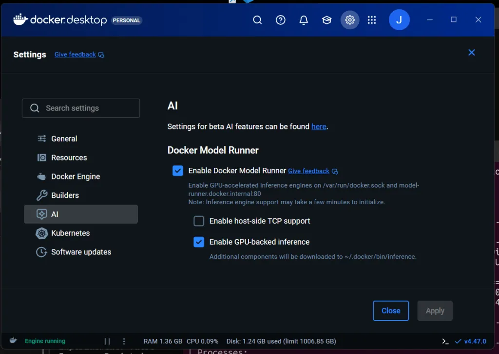
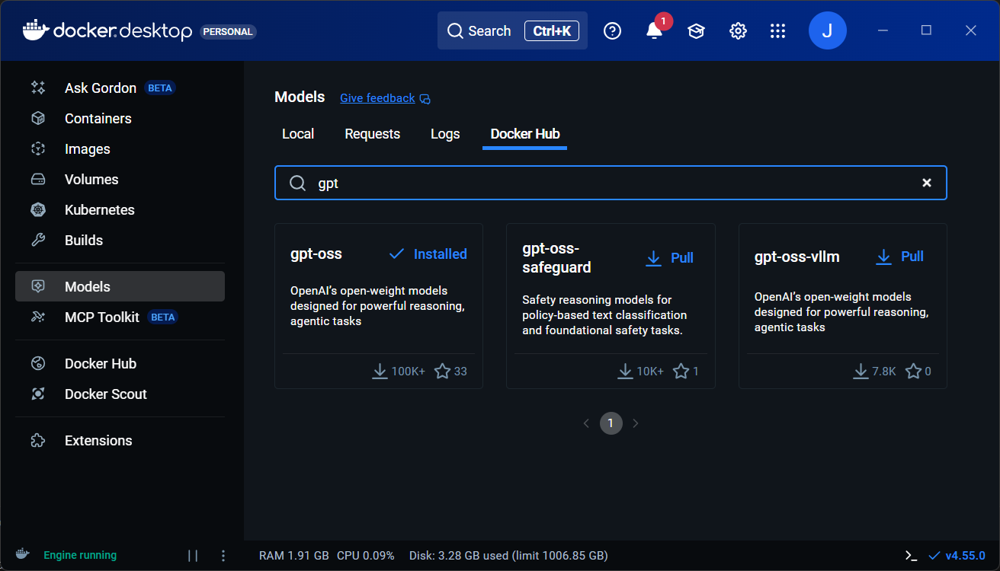

# Docker Model Runner: Running Models Locally

> VS Code–driven, terminal-first walkthrough of Docker Model Runner (DMR).
> One local runtime. Multiple clients. CPU or GPU. No cloud APIs.

---

## 01 - Why Docker Model Runner

* Local model execution used to be fragile and ad-hoc
* Containers already solved reproducibility and lifecycle
* DMR applies **Docker discipline to model execution**
* Models become managed local infrastructure

---

## 02 - What DMR is (and is not)

* Docker-managed local **model runtime**
* Exposed via CLI and local HTTP
* Models ≠ containers
* Execution ≠ `docker run`

**Not:** agents, orchestration, cloud inference

---

## 03 - Enable DMR in Docker Desktop

* Docker Desktop → Settings → AI
* Enable **Docker Model Runner**
* Enable **GPU-backed inference** if available
* Optional: enable host-side TCP

Docker manages CUDA and inference engines.




---

## 04 - Verify runner status

```powershell
docker model status
```

Shows which backend is active (CPU or GPU).

---

## 05 - Model lifecycle (CLI + Docker Desktop)



```powershell
docker model pull smollm3:Q8_0
docker model pull gpt-oss
```

* Explicit model artifacts
* Local storage
* Visible in Docker Desktop

---

## 06 - Run a model locally

```powershell
docker model run smollm3:Q8_0 "What is Docker Model Runner? One sentence."
```

* Cold start
* Token streaming
* No containers created
* Logs visible in Docker Desktop

---

## 07 - Package a model (context size)

Context size is **not a runtime flag**. It is part of the model artifact.

```powershell
docker model package --from ai/smollm3:Q8_0 --context-size 8192 jgc/smollm3:Q8_0_ctx8k
```

```powershell
docker model run jgc/smollm3:Q8_0_ctx8k "DMR: one sentence."
```

* Predictable memory usage
* Reproducible capacity

---

## 08 - CPU vs GPU execution (host-dependent)

DMR selects the backend automatically.

```powershell
docker model status
```

* CPU-only host: CPU-bound execution
* GPU host: accelerated inference

Same command. Same model. Different hardware.

---

## 09 - Demo app (real client)

Run the Python client locally:

```powershell
cd demo-app
set LLM_BASE_URL=http://localhost:12434
set LLM_MODEL=jgc/smollm3:Q8_0_ctx8k
python -m openai_web_client
```

* No API keys
* Fully local
* Long-running client

---

## 10 - Same app, containerized

```powershell
docker compose up
```

* App in container
* Model runner on host
* Model selected via env vars
* Zero code changes

---

## Close

* Local-first AI is practical today
* Docker Model Runner removes ceremony
* Models behave like infrastructure
* One runtime, many clients
